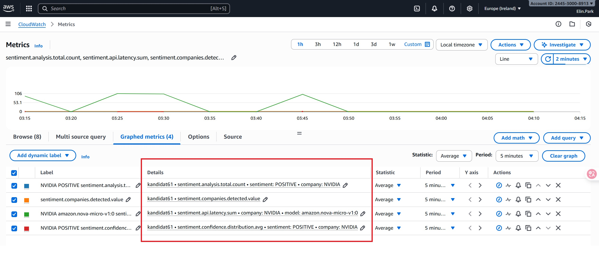
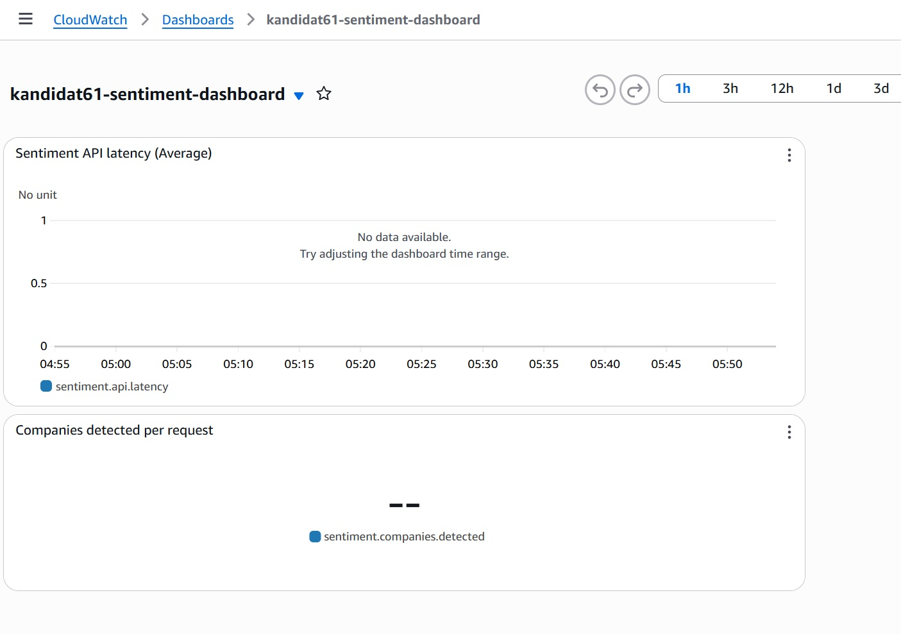
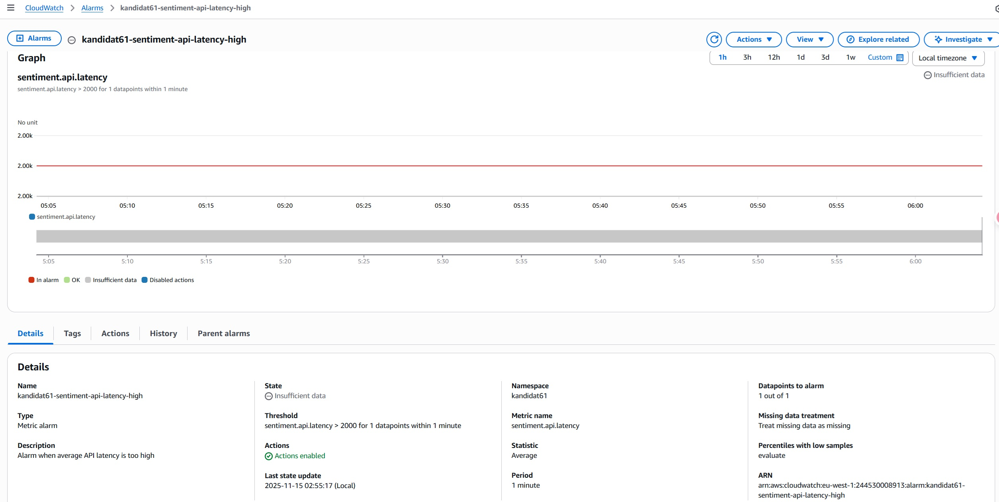
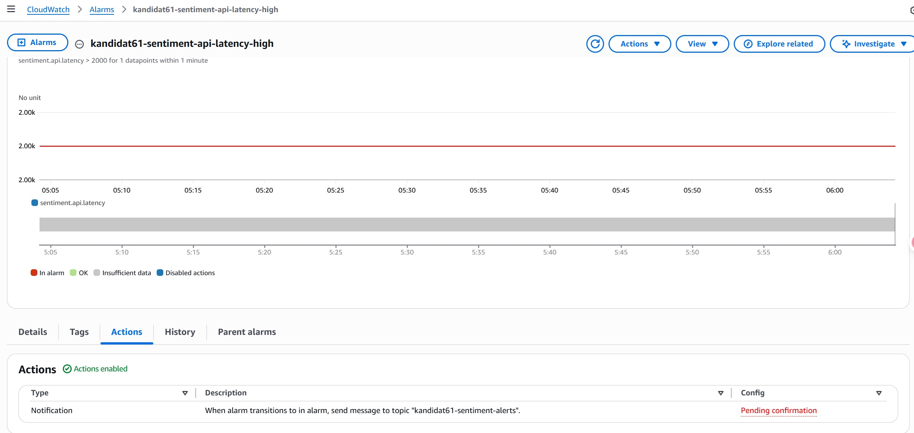
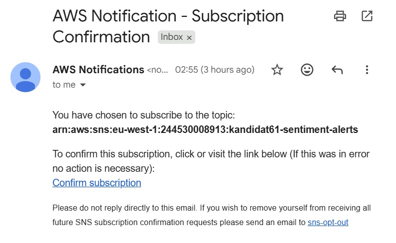

# Oppgave 1
I oppgave 1 har jeg satt opp en S3-bucket `kandidat-61-data` i region `eu-west-1` ved hjelp av Terraform. Bucketen har en egen lifecycle-policy for prefix `midlertidig/`, der objekter flyttes til GLACIER etter 30 dager og slettes etter 60 dager. Øvrige objekter i bucketen blir liggende permanent. I tillegg er public access blokkert, og versjonering er aktivert. Terraform state lagres i S3-backend pgr301-terraform-state, slik at infrastrukturen kan kjøres repeterbart via Terraform og GitHub Actions.

# Oppgave 2
## Del A
- API Gateway URL: https://zy054y3jhj.execute-api.eu-west-1.amazonaws.com/Prod/analyze/

- S3 objekt: s3://kandidat-61-data/midlertidig/comprehend-20251113-213527-2718ec4f.json

## Del B
- Workflow-fil: https://github.com/ElinEunjung/pgr301-exam-2025-kandidatnr-61/blob/main/.github/workflows/sam-deploy.yml

- Successful deploy: https://github.com/ElinEunjung/pgr301-exam-2025-kandidatnr-61/actions/runs/19348191692/job/55353731117

- PR validation: https://github.com/ElinEunjung/pgr301-exam-2025-kandidatnr-61/pull/2/checks

- Instrukskjoner til sensor:
For å kjøre workflowen i din egen GitHub-repository, legg inn `AWS_ACCESS_KEY_ID` og `AWS_SECRET_ACCESS_KEY` under **Github Settings** -> **Secrets**-> **Actions**. Workflowen kjører deretter automatisk ved **PR** (validation only) og ved **push** til `main` (full deploy). Ingen ytterligerec onfigurationendringer er nødvendig. 

# Oppgave 3
## Del A
`sentiment-docker/Dockerfile` 
Av sikkerhetsgrunner bruker jeg `.env` og `--env-file` lokalt. Filen`.env_exmaple` er sjekket inn i repoet kun for å vise hvilke variabler som forventes i `.env`. Selve `.env`-filen er *ikke* sjekket inn i repositoriet.

## Del B
- Workflow-fil: https://github.com/ElinEunjung/pgr301-exam-2025-kandidatnr-61/blob/main/.github/workflows/docker-build.yml

- Successful build: https://github.com/ElinEunjung/pgr301-exam-2025-kandidatnr-61/actions/runs/19352017911/job/55365565358

- Tagging-strategi: I Docker Hub bruker jeg en tagging-strategi med både `latest` og commit-baserte tags.
Hver build til main publiserer imaget som `latest` (siste versjon for enkel testing) og i tillegg som `sha-<commit>` (for eksempel `sha-a1b2c3d`). `latest` gjør det enkelt å alltid hente nyeste versjon, mens `sha-<commit>` gir en entydig kobling mellom Docker-image og Git-commit, noe som er nyttig for feilsøking, reproduksjon og eventuell rollback.

- Container image navn: `elineunjung/sentiment-docker:latest`

- Beskrivelse for sensor:
For at `.github/workflows/docker-build.yml` skal fungeres i sensor sin fork, må sensor gjøre følende.
  1. Opprette en egen Docker Hub-konto og repository.
  2. Lage et Docker Hub access token med *read & write*-tilgang
  3. Legge inn Github Secrets i sin fork: 
    - `DOCKER_USERNAME` = sensor sin Docker Hub-bruker
    - `DOCKER_TOKEN` = access token fra Docker Hub
  4. Aktiver GitHub Actions og trigge workflow
        Siden `workflow_dispatch` er aktivert, kan workflowen startes uten at det gjøres endringer i `sentiment-docker/**` i `main` branch
Siden image-taggen bygges ut fra `DOCKER_USERNAME`-secret, trenger sensor kun å konfigurere egne secrets. Workflow-filen kan brukes uendret. 

# Oppgave 4
## Del A

For design har jeg valgt å bruke fire metrics i `SentimentMetrics`:
- Counter `sentiment.analysis.total`: teller analyser per sentiment og selskap
- Timer `sentiment.api.latency`: måler responstid til Bedrock API per selskap og modell
- Gauge `sentiment.companies.detected`: antall selskaper som ble funnet i siste forespørsel
- DistributionSummary `sentiment.confidence.distribution`: viser fordeling av confidence-verdier

Disse metrics registreres fra `SentimentController.analizeSentimet()` etter at Bedrock API-kallet er feridg.

Fra DevOps-perspektiv gjør dette det mulig å overvåke  ytelse, pålitelighet og modellkvalitet gjennom trafikk (bruk), latency (ytelse), antall selskaper per forespørsel (kompeksitet) og confidence-score (modellkvalitet). Alle metrics eksporteres til CloudWatch under namespace `kandidat61`. 

## Del B
- Terraform-kode: kode ligger i `infra-cloudwatch/`

- Dashboard Screenshot:
 Dashboardet er definert i Terraform og viser to widgets (latency + gauge) som en timeSerie-graf og en singleValue (kun siste verdi). CloudWatch kan vise tomme grafer hvis applikasjonen nylig er startet eller har lite datapunkter, men dashboard-strukturen bekrefter at metrikker er riktig konfigurert og visualisert i henhold til oppgaven.
 

- Alarm Screenshot: 
Skjermbildet viser min alarm `kandidat61-sentiment-latency-high`, som overvåker metrikken `sentiment.api.latency` (Average). Alarmen går i ALARM dersom latensen overskrider en terskel på 2 sekunder. 2 sekunder er en rimelig terskel for en responsiv AI-tjeneste i et DevOps-miljø. 

- Alarmen `kandidat61-sentiment-api-latency-high` er konfigurert med en SNS-notifikasjon. Når alarmen går i *ALARM*, sendes det en melding til SNS-topic `kandidat61-sentiment-alerts`, som igjen er koblet til en e-post-subscription(på skjermbildet: “Pending confirmation”). Dette viser at alarm actions er
korrekt konfigurert i Terraform og klart til å sende varsler.

- E-post Screenshot:
Nedenfor vises skjermbildet av e-posten jeg mottok fra AWS SNS for å bekrefte subscription til topic `kandidat61-sentiment-alerts`

# Oppgave 5
KI-assistert programvareutvikling påvirker DevOps-prinsippene både positivt og negativt. AI-assistenter som Copilot, ChatGPT og Claude kan øke utviklingshastigheten ved å generere boilerplate-kode, foreslå løsninger, skrive dokumentasjon og hjelpe utviklere med å lære ny teknologi raskere. Samtidig kan AI-genererte løsninger introdusere feil, sikkerhetsrisiko og en overfladisk forståelse hos utviklere som blir for avhengige av automatiserte forslag. I denne drøftingen vurderer jeg hvordan KI påvirker Flyt, Feedback og Kontinuerlig læring i en DevOps-kontekst.

**Flyt (Flow)**  
KI kan øke tempoet dramatisk ved å redusere arbeid på repetitive oppgaver som tester, dokumentasjon og standardiserte konfigurasjonsfiler. Dette kan fjerne flaskehalser i DevOps- pipelines og gjøre det enklerer å levere hyppige iterasjoner. Samtidig kan AI introdusere nye utfordringer: generert kode kan bryte arkitekturregler, inneholde skjulte feil eller skape teknisk gjeld som først oppdages senere i pipeline. Det jeg opplevde i denne eksamenen illustrerer dette: KI kunne raskt generere Terraform-boilerplate og GitHub Actions-filer, men jeg måtte manuelt validere lifecycle-regler og IAM-innstillinger for å sikre at infrastrukturen oppførte seg korrekt. I tillegg kan AI-genererte løsninger ta lengre tid å validere, og risikoen for «cargo-cult coding» - å kopiere uten forståelse – øker. Dermed kan høy hastighet i starten faktisk redusere den totale flyten over tid. 

**Feedback**  
KI kan også forbedre feedback-mekanismene i systemutvikling. Verktøy kan generere tester, analysere logger og til og med foreslå observabilitetsstrukturer som dashboards og metrikker. I oppgave 4 i eksamen fikk jeg foreslått metrikk-konstruksjoner av KI, men uten CloudWatch-feedback ville jeg ikke visst om latens (latency), antall analyser eller kvaliteten på kjøringen faktisk fungerte i runtime. CI/CD-pipelines gir også rask tilbakemelding på AI-generert kode gjennom automatiserte tester, bygg og deploy. Utfordringen er at AI-generert kode ikke alltid er intuitiv å forstå, og dermed vanskeligere å evaluere. Dette krever forsterkede feedback-mekanismer: mer robust testing, strengere linting, bedre sikkerhetstiltak og god observabilitet. Det finnes også en risiko for at utviklere lærer mindre av egne feil når AI retter problemer umiddelbart.

**Kontinuerlig læring og forbedring**  
KI kan fungere som en mentor som gir forklaringer, demonstrasjoner og dokumentasjon på en måte som gjør læringsprosessen både raskere og mer tilgjengelig. Det senker terskelen for å prøve nye teknologier og gir teamet mulighet til å øke kunnskapsdelingen gjennom genererte forslag og forklaringer. Samtidig kan overdreven bruk av KI føre til tap av dybdeforståelse. Utviklere kan bli mer avhengige av automatiserte løsninger, noe som gjør det vanskeligere å forstå komplekse arkitekturer eller debugge problemer i fremtiden. Jeg erfarte dette i et tidligere webutviklingsprosjekt: jeg kunne bygge et helt nytt system med et rammeverk utenfor pensum, men etter hvert ble jeg for avhengig av KI-assistenter. Debugging tok lengre tid fordi jeg ikke hadde bygget opp tilstrekkelig forståelse av koden som var generert. Det var en viktig erfaring som lærte meg hvordan KI bør brukes med måte for å bevare kompetanseutviklingen.

KI-verktøy øker arbeidstempoet og senker terskelen for å komme i gang med programvareutvikling, men dette krever samtidig sterkere kontrollmekanismer og mer moden DevOps-kultur. Menneskelige ferdigheter som systemarkitektur, sikkerhet, problemløsning og kritisk tenkning blir enda mer verdifulle når KI er en del av utviklingsprosessen. KI kan være en kraftig støtte, men det kan ikke erstatte en utvikler som forstår helheten og bruker verktøyene balansert. Når DevOps-prinsippene kombineres med KI på en ansvarlig måte, kan organisasjoner oppnå både høyere hastighet, bedre kvalitet og sterkere læringskultur. 

